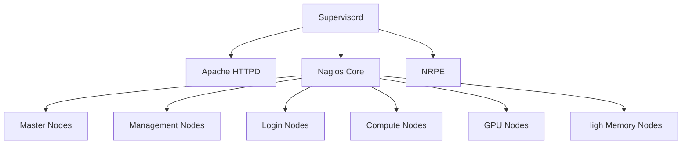

# Nagios Server Container for Rocky Linux 9.6

## Overview

This project provides a containerized Nagios monitoring server based on Rocky Linux 9.6.

The container includes:

* Nagios Core
* Nagios Plugins
* NRPE
* Apache HTTPD
* Supervisor
* Python3
* Dynamic host generation scripts
* HPC Cluster Monitoring Support

The solution is designed for monitoring:

* Master Nodes
* Management Nodes
* Login Nodes
* Compute Nodes
* GPU Nodes
* High Memory Nodes

---

# Architecture



---

# Build Docker Image

Clone repository:

```bash
git clone <repository_url>

cd nagios-rocky9.6
```

Build image:

```bash
# Pull the rocky9.6 base image in your env
wget --user='<username>' --password='<enterprise_version_you_have_to_ask>' https://hpcsangrah-test.pune.cdac.in/vault/OpenCHAI/hpcsuite_registry/container_img_reg/rocky9.6/rockylinux_reg/rockylinux_9.6 --no-check-certificate
# Alternate you can build rockylinux9.6 using this link
https://github.com/OpenHPC-AI/rocky-linux-container-base-image-el9

#Once the image is pulled, load in your env
docker load < rockylinux_9.6

#Build the docker images
docker build -t cdac_nagios/rocky9.6:4.4.14 --network host .
```

Verify:

```bash
docker images
```

Expected:

```text
REPOSITORY              TAG       IMAGE ID
cdac_nagios/rocky9.6    4.4.14    xxxxxxxxxxxx
```

---

# Create Required Directories

```bash
mkdir -p /hpctool_stack/nagios

mkdir -p /hpctool_stack/nagios/nagiosdata

mkdir -p /hpctool_stack/nagios/conf

mkdir -p /hpctool_stack/nagios/log
```

---

# Docker Compose Deployment

Create:

```bash
cd ./portable
#Verify Once all the environment variable is listed from .env
vi docker-compose.yml

#Update the .env file according to your environment
vi .env
```

Start container:

```bash
bash run.sh
```

Verify:

```bash
docker ps
```

---

# Access Nagios Web Interface

Using Host Networking:

```text
#Assigned port in .env file
http://<server-ip>:<port>/nagios
```

Example:

```text
http://192.168.1.10:10010/nagios
```

Login:

```text
#Assigned in .env file
Username : nagiosadmin
Password : <configured password>
```

---

# Configure Cluster Nodes

Enter container:

```bash
docker exec -it nagios bash
```

Go to configuration directory:

```bash
cd /nagios_conf
```

Generate node definitions:

```bash
./hosts.cfg_add.sh
```

Example:

```text
Enter Template Name: PARAM RUDRA

Add MASTER nodes? (y/n): y

Add MANAGEMENT nodes? (y/n): y

Add LOGIN nodes? (y/n): y

Add COMPUTE nodes? (y/n): y

Add HIGH MEMORY nodes? (y/n): n

Add GPU nodes? (y/n): y
```

The script automatically:

* Creates hosts.cfg
* Creates services.cfg
* Generates node definitions
* Validates Nagios configuration

---

Expected:

```text
Things look okay - No serious problems were detected
```

---

# Reload Nagios

```bash
supervisorctl restart nagios
```

---

# Supervisor Management

Check status:

```bash
supervisorctl status
```

Example:

```text
httpd      RUNNING
nagios     RUNNING
nrpe       RUNNING
```

---

## Restart Nagios

```bash
supervisorctl restart nagios
```

---

## Restart Apache

```bash
supervisorctl restart httpd
```

---

## Restart NRPE

```bash
supervisorctl restart nrpe
```

---

## Restart All Services

```bash
supervisorctl restart all
```

---

## Stop Nagios

```bash
supervisorctl stop nagios
```

---

## Start Nagios

```bash
supervisorctl start nagios
```

---

# View Logs

Nagios:

```bash
supervisorctl tail nagios
```

Apache:

```bash
supervisorctl tail httpd
```

NRPE:

```bash
supervisorctl tail nrpe
```

Supervisor:

```bash
cat /var/log/supervisor/supervisord.log
```

---

# Container Health Verification

Verify processes:

```bash
ps -ef | egrep "nagios|httpd|nrpe"
```

Verify web server:

```bash
curl http://localhost/nagios
```

Verify Nagios configuration:

```bash
nagios -v /etc/nagios/nagios.cfg
```

---

# Persistent Data

The following directories are persistent:

| Host Directory                   | Container Directory |
| -------------------------------- | ------------------- |
| /hpctool_stack/nagios/conf       | /etc/nagios/conf.d  |
| /hpctool_stack/nagios/log        | /var/log/nagios     |
| /hpctool_stack/nagios/nagiosdata | /nagiosdata         |

Container upgrades will not remove monitoring configuration.

---

# Troubleshooting

Validate configuration:

```bash
nagios -v /etc/nagios/nagios.cfg
```

Check supervisor:

```bash
supervisorctl status
```

Check Apache:

```bash
# Assign in .env file
curl http://localhost:<port>/nagios
```

Check running processes:

```bash
ps -ef
```

Check container logs:

```bash
docker logs nagios
```

---

# License

This project is intended for HPC cluster monitoring environments and can be customized for enterprise infrastructure monitoring deployments.
